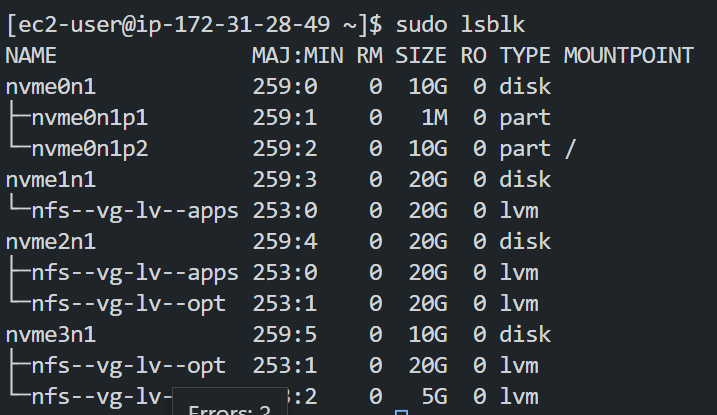
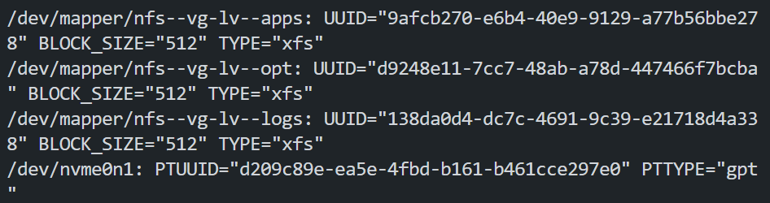
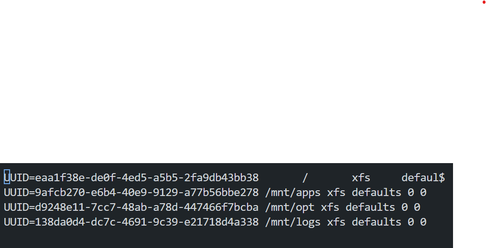

# project-7-DEVOPS-TOOLING-WEBSITE-SOLUTION
In this project, we would learn how to build a DevOps tooling website.

## Table of Contents
- [Introduction](#introduction)
- [Step1](#Step 1 - Prepare NFS Server)
- [Step2](#Step 1 - Prepare NFS Server)


### Introduction


### Step 1 - Prepare NFS Server
In this step, we would prepare the Network File system server.
1. Create a new EC2 instance with RHEL Linux 8 AMI.

    Results:
    


2. Configure LVM on the server.
- Create and attach 3 volumes to the server.

    Results:
    

- Connect to your Linux instance and check if the volumes are attached using the following command:
    ```
    lsblk
    ```
    Results:
    

- Use gdisk utility to create a single partition on each of the 3 disks.
    ```
    sudo gdisk /dev/nvme1n1 /dev/nvme2n1 /dev/nvme3n1
    ```
    Results:
    

- Then install the lvm2 package using the following command:
    ```
    sudo yum install lvm2
    ```
    and then run the following command to check for available partitions:
    ```
    sudo lvmdiskscan
    ```
    Results:
    
    
    Note: Unlike Ubuntu which uses apt, for redhat the package manager is yum.

- Now after checking that there's no logical volume present, we need to create a physical volume on each of the 3 disks using the following command:
    ```
    sudo pvcreate /dev/nvme1n1 
    sudo pvcreate /dev/nvme2n1 
    sudo pvcreate /dev/nvme3n1
    ```
    Results:
    

- Now we need to verify that our physical volume has been created successfully using the following command:
    ```
    sudo pvs
    ```
    Results:
    

- Now we need to create a volume group using the vgcreate utility. We will use the 3 disks we created earlier to create a volume group called nfs-vg.
    ```
    sudo vgcreate nfs-vg /dev/nvme1n1 /dev/nvme2n1 /dev/nvme3n1
    ```
    Results:
    

- Use lvcreate utility to create 3 logical volumes. lv-opt lv-apps, and lv-logs. The lv-apps: would be used by the webservers, The lv-logs: would be used by web server logs, and the lv-opt: would be used by the Jenkins server.
    ```
    sudo lvcreate -L 20G -n lv-opt nfs-vg
    sudo lvcreate -L 20G -n lv-apps nfs-vg
    sudo lvcreate -L 10G -n lv-logs nfs-vg
    ```
    Results:
    

- Now we need to verify that our logical volumes have been created successfully using the following command:
    ```
    sudo lvs
    ```
    Results:
    

- Verify the entire setup
    ```
    sudo vgdisplay -v #view complete setup - VG, PV, and LV
    sudo lsblk
    ```
    Results:
    
    

- Use mkfs.xfs to format the logical volumes with xfs filesystem.
    ```
    sudo mkfs -t xfs /dev/nfs-vg/lv-opt
    sudo mkfs -t xfs /dev/nfs-vg/lv-apps
    sudo mkfs -t xfs /dev/nfs-vg/lv-logs
    ```
    Results:
    

- Create a directory for each of the logical volumes.
    ```
    sudo mkdir -p /mnt/apps
    sudo mkdir -p /mnt/logs
    sudo mkdir -p /mnt/opt
    ```
    Results:
    

- Mount the logical volumes to the directories we created earlier.
    ```
    sudo mount /dev/nfs-vg/lv-apps /mnt/apps
    sudo mount /dev/nfs-vg/lv-logs /mnt/logs
    sudo mount /dev/nfs-vg/lv-opt /mnt/opt
    ```
    Results:
    

- Verify that the logical volumes have been mounted successfully.
    ```
    sudo df -h
    ```
    Results:
    

- Now we need to make the mount persistent. To do that, we need to edit the /etc/fstab file and add the following lines:
    ```
    sudo blkid
    sudo nano /etc/fstab
    ```
    Results:
    
    

- Now we need to test the configurations and reload the daemon.
    ```
    sudo mount -a
    sudo systemctl daemon-reload
    ```
    Results:
    


    - It is about time for us to install the NFS server. To do that, we need to install the nfs-utils package using the following command:
    ```
    sudo yum -y update
    sudo yum install -y nfs-utils
    sudo systemctl start nfs-server.service
    sudo systemctl enable nfs-server.service
    sudo systemctl status nfs-server.service
    ```
    Results:
    

- Now we need to set up permissions that will allow our webservers to read, write and execute files on NFS:
    ```
    sudo chown -R nobody: /mnt/apps
    sudo chown -R nobody: /mnt/logs
    sudo chown -R nobody: /mnt/opt
    sudo chmod -R 777 /mnt/apps
    sudo chmod -R 777 /mnt/logs
    sudo chmod -R 777 /mnt/opt
    ```
    Results:
    

- Now we need to edit the /etc/exports file and add the following lines:
    ```
    sudo nano /etc/exports
    ```
    add the following:
    ```
    /mnt/apps <Subnet-CIDR>(rw,sync,no_all_squash,no_root_squash)
    /mnt/logs <Subnet-CIDR>(rw,sync,no_all_squash,no_root_squash)
    /mnt/opt <Subnet-CIDR>(rw,sync,no_all_squash,no_root_squash)
    ```
    and then run the command:
    ```
    sudo exportfs -arv
    ```
    Results:
    
    