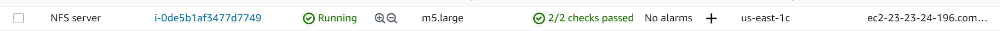

# project-7-DEVOPS-TOOLING-WEBSITE-SOLUTION
In this project, we would learn how to build a DevOps tooling website.

## Table of Contents
- [Introduction](#introduction)
- [Step1](#Step 1 - Prepare NFS Server)
- [Step2](#Step 2 - Configure the database server)
- [Step3](#Step 3 - Configure the web servers)


### Introduction


### Step 1 - Prepare NFS Server
In this step, we would prepare the Network File system server.
1. Create a new EC2 instance with RHEL Linux 8 AMI.

    Results:
    


2. Configure LVM on the server.
- Create and attach 3 volumes to the server.

    Results:
    

- Connect to your Linux instance and check if the volumes are attached using the following command:
    ```
    lsblk
    ```
    Results:
    

- Use gdisk utility to create a single partition on each of the 3 disks.
    ```
    sudo gdisk /dev/nvme1n1 /dev/nvme2n1 /dev/nvme3n1
    ```
    Results:
    

- Then install the lvm2 package using the following command:
    ```
    sudo yum install lvm2
    ```
    and then run the following command to check for available partitions:
    ```
    sudo lvmdiskscan
    ```
    Results:
    
    
    Note: Unlike Ubuntu which uses apt, for redhat the package manager is yum.

- Now after checking that there's no logical volume present, we need to create a physical volume on each of the 3 disks using the following command:
    ```
    sudo pvcreate /dev/nvme1n1 
    sudo pvcreate /dev/nvme2n1 
    sudo pvcreate /dev/nvme3n1
    ```
    Results:
    

- Now we need to verify that our physical volume has been created successfully using the following command:
    ```
    sudo pvs
    ```
    Results:
    

- Now we need to create a volume group using the vgcreate utility. We will use the 3 disks we created earlier to create a volume group called NFS-vg.
    ```
    sudo vgcreate nfs-vg /dev/nvme1n1 /dev/nvme2n1 /dev/nvme3n1
    ```
    Results:
    

- Use lvcreate utility to create 3 logical volumes. lv-opt lv-apps, and lv-logs. The lv-apps: would be used by the webservers, The lv-logs: would be used by web server logs, and the lv-opt: would be used by the Jenkins server.
    ```
    sudo lvcreate -L 20G -n lv-opt nfs-vg
    sudo lvcreate -L 20G -n lv-apps nfs-vg
    sudo lvcreate -L 10G -n lv-logs nfs-vg
    ```
    Results:
    

- Now we need to verify that our logical volumes have been created successfully using the following command:
    ```
    sudo lvs
    ```
    Results:
    

- Verify the entire setup
    ```
    sudo vgdisplay -v #view complete setup - VG, PV, and LV
    sudo lsblk
    ```
    Results:
    
    ![image]
    
- Use mkfs.xfs to format the logical volumes with xfs filesystem.
    ```
    sudo mkfs -t xfs /dev/nfs-vg/lv-opt
    sudo mkfs -t xfs /dev/nfs-vg/lv-apps
    sudo mkfs -t xfs /dev/nfs-vg/lv-logs
    ```
    Results:
    

- Create a directory for each of the logical volumes.
    ```
    sudo mkdir -p /mnt/apps
    sudo mkdir -p /mnt/logs
    sudo mkdir -p /mnt/opt
    ```
    Results:
    

- Mount the logical volumes to the directories we created earlier.
    ```
    sudo mount /dev/nfs-vg/lv-apps /mnt/apps
    sudo mount /dev/nfs-vg/lv-logs /mnt/logs
    sudo mount /dev/nfs-vg/lv-opt /mnt/opt
    ```
    Results:
    

- Verify that the logical volumes have been mounted successfully.
    ```
    sudo df -h
    ```
    Results:
    

- Now we need to make the mount persistent. To do that, we need to edit the /etc/fstab file and add the following lines:
    ```
    sudo blkid
    sudo nano /etc/fstab
    ```
    Results:
    
    

- Now we need to test the configurations and reload the daemon.
    ```
    sudo mount -a
    sudo systemctl daemon-reload
    ```
    Results:
    


    - It is about time for us to install the NFS server. To do that, we need to install the nfs-utils package using the following command:
    ```
    sudo yum -y update
    sudo yum install -y nfs-utils
    sudo systemctl start nfs-server.service
    sudo systemctl enable nfs-server.service
    sudo systemctl status nfs-server.service
    ```
    Results:
    

- Now we need to set up permissions that will allow our web servers to read, write and execute files on NFS:
    ```
    sudo chown -R nobody: /mnt/apps
    sudo chown -R nobody: /mnt/logs
    sudo chown -R nobody: /mnt/opt
    sudo chmod -R 777 /mnt/apps
    sudo chmod -R 777 /mnt/logs
    sudo chmod -R 777 /mnt/opt
    ```
    Results:
    

- Now we need to edit the /etc/exports file and add the following lines:
    ```
    sudo nano /etc/exports
    ```
    add the following:
    ```
    /mnt/apps <Subnet-CIDR>(rw,sync,no_all_squash,no_root_squash)
    /mnt/logs <Subnet-CIDR>(rw,sync,no_all_squash,no_root_squash)
    /mnt/opt <Subnet-CIDR>(rw,sync,no_all_squash,no_root_squash)
    ```
    and then run the command:
    ```
    sudo exportfs -arv
    ```
    Results:
    
    

- Now we need to check the port being used by NFS and open it using Security Groups(add a new inbound Rule):
    ```
    rpcinfo -p | grep nfs
    ```
    Results:
    

    Note: For the NFS server to be accessible from your client, you must also open the following ports: TCP 111, UDP 111, and UDP 2049.


### Step 2: - Configure the database server
- Create a new instance of ubuntu and ssh into it.
    ```
    ssh -i "key.pem" ubuntu@<IP>
    ```
    Results:
    

- Install the MySQL server using the following command:
    ```
    sudo apt install mysql-server
    ```
    Results:
    
    
- Create a database name called tooling
    ```
    sudo mysql
    CREATE DATABASE tooling;
    ```
    Results:
    

- Create a database user and name it webaccess
    ```
    CREATE USER 'webaccess'@'%' IDENTIFIED BY 'password';
    ```
    Results:
    
    Note: The '%' should be replaced with the address of the subnet CIDR of your webservers.

- Grant the webaccess user all privileges on the tooling database.
    ```
    GRANT ALL PRIVILEGES ON tooling.* TO 'webaccess'@'%';
    ```
    Results:
    

- Now we need to flush all privileges.
    ```
    FLUSH PRIVILEGES;
    ```
    Results:
    

- Now let's show our databases and users.
    ```
    SHOW DATABASES;
    ```
    Results:
    

- Now let's navigate to the tooling database and show tables.
    ```
    USE tooling;
    SHOW TABLES;
    ```
    Results:
    


### Step 3: - Configure the web servers
- Create a new instance of RedHat and ssh into it.
    ```
    ssh -i "key.pem" redhat@<IP>
    ```

- Install NFS client using the following command:
    ```
    sudo yum install -y nfs-utils nfs4-acl-tools
    ```
    Results:
    

- Create a directory called /var/www/ and target the NFS server's export for apps
    ```
    sudo mkdir /var/www
    sudo mount -t nfs -o rw,nosuid <NFS-Server-IP>:/mnt/apps /var/www
    ```
    Results:
    

- Verify that NFS was mounted successfully.
    ```
    sudo df -h
    ```
    Results:
    

- Make sure that the changes will persist on the web server after reboot.
    ```
    sudo nano /etc/fstab
    ```
    add the following:
    ```
    <NFS-Server-IP>:/mnt/apps /var/www nfs defaults 0 0
    ```
    Results:
    

- Install Remi's repository, Apache and PHP
    ```
    sudo yum install httpd -y
    sudo dnf install https://dl.fedoraproject.org/pub/epel/epel-release-latest-8.noarch.rpm

    sudo dnf install dnf-utils http://rpms.remirepo.net/enterprise/remi-release-8.rpm

    sudo dnf module reset php

    sudo dnf module enable php:remi-7.4

    sudo dnf install php php-opcache php-gd php-curl php-mysqlnd

    sudo systemctl start php-fpm

    sudo systemctl enable php-fpm

    setsebool -P httpd_execmem 1
    ```
    Results:
    
    
    
    
    
    
    

- Repeat the previous step for another 2 Web Servers.

- To verify that Apache files and directories are available on the Web Server in /var/www and also on the NFS server in /mnt/apps. If you see the same files – it means NFS is mounted correctly. You can try to create a new file touch test.txt from one server and check if the same file is accessible from other Web Servers.
    ```
    sudo touch test.txt
    ```
    Results:
    
    and on the other web servers:
    

- Now we need to locate the log folder for Apache on the web server and mount it to the NFS server's export for logs and make sure that the changes will persist on the web server after reboot on all the web servers.
    ```
    sudo mkdir /var/log/httpd
    sudo mount -t nfs -o rw, nosuid <NFS-Server-IP>:/mnt/logs /var/log/httpd
    ```
    <!-- Results:
     -->
    and then add the following to /etc/fstab:
    ```
    sudo nano /etc/fstab
    ```
    add the following:
    ```
    <NFS-Server-IP>:/mnt/logs /var/log/httpd nfs defaults 0 0
    ```
    Results:
    
    

- Now we need to install git on any of the web servers.
    ```
    sudo yum install git
    ```
    Results:
    

- Now we need to clone the repository from GitHub to the web server.
    ```
    git clone https://github.com/manny-uncharted/tooling.git
    ```
    Results:
    

- And now we need to copy the files from the html folder in the repository to the /var/www/html directory.
    ```
    cd tooling
    sudo cp -r html/* /var/www/html/
    ```
    and to verify that the files were copied successfully:
    ```
    sudo ls /var/www/html/
    ```
    Results:
    
    

Note: If you encounter 403 Error – check permissions to your /var/www/html folder and also disable SELinux sudo setenforce 0. To make this change permanent – open following config file sudo nano /etc/sysconfig/selinux and set SELINUX=disabledthen restrt httpd.


- Now we need to update the website’s configuration to connect to the database (in /var/www/html/functions.php file). 
    ```
    sudo nano /var/www/html/functions.php
    ```
    Results:
    

- Then we apply tooling-db.sql script to your database using this command:
    ```
    sudo yum install mysql -y
    mysql -h <private-ip-of-db> -u webaccess -p tooling < tooling-db.sql
    ```
    Note: Ensure that you edit the /etc/mysql/mysql.conf.d/mysqld.cnf file to allow remote access to the database.

    Results:
    

- Now we need to create in MySQL a new admin user with username: myuser and password: password:
    ```
    INSERT INTO users (‘id’, ‘username’, ‘password’, ’email’, ‘user_type’, ‘status’) VALUES
    (2, ‘myuser’, ‘5f4dcc3b5aa765d61d8327deb882cf99’, ‘user@mail.com’, ‘admin’, 1);
    ```
    Results:
    

- Now we can then open the website in the browser and login with the new user.
    Results:
    
